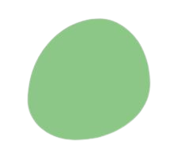
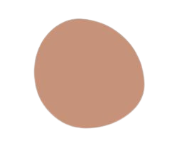
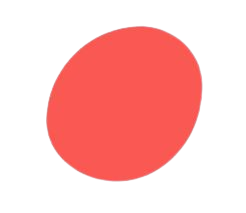
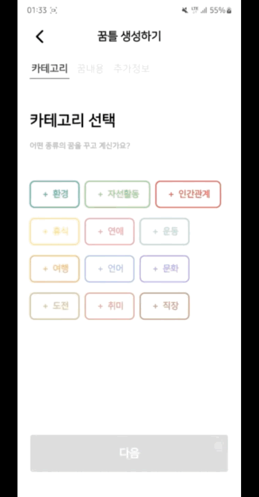
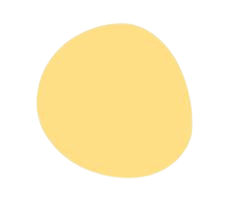
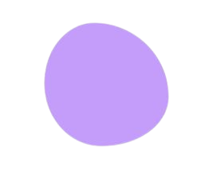
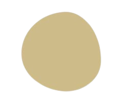

#  꿈 : 틀 소개

    꿈, 이제는 정말 이뤄나갈 시간.
    마음에만 담아두지 말고 꿈틀에 담아보세요.

    다른 사람들은 가슴 한켠에 어떤 꿈을 품은 채 살아갈까요?
    나와 같은 꿈을 먼저 이룩한 선배 꿈꾼이는 어떤 여정을 겪었을까요?

    꿈틀에서 다채롭고 감동적인 꿈들을 만나보세요.
    꿈나라로 초대합니다. 꿈틀에서 만나요.

 

#  팀 소개

|                                     이우성                                      |                                      이원주                                      |                                     전지환                                      |                                      서준호                                      |                                     신창엽                                      |                                     조인화                                      |
| :-----------------------------------------------------------------------------: | :------------------------------------------------------------------------------: | :-----------------------------------------------------------------------------: | :------------------------------------------------------------------------------: | :-----------------------------------------------------------------------------: | :-----------------------------------------------------------------------------: |
|  |  |  |  |  |  |
|           `FE` `QA` [@leewooseong](https://github.com/leewooseong)           |                  `FE 리더` [@3o14](https://github.com/3o14)                   |         `BE` `PM` [@DarkBlackRice](https://github.com/DarkBlackRice)         |                `BE` `INFRA` [@ho97s](https://github.com/ho97s)                |             `BE 리더` [@404](https://github.com/404-not-foundl)              |               `BE` `QA` [@jjjoina](https://github.com/jjjoina)               |

 

#  서비스 주요 기능

<table>
  <tbody>
    <tr>
      <td align="center" valign="top" width="25%" > <b>1. 레이다 팔로잉탭</b> 
      메인 화면은 친밀도를 기반으로 마음의 거리를 반영한 레이더입니다. 다른 유저와 댓글, 공감, 피드 방문 등의 상호작용을 통해 친밀도를 올릴 수 있습니다.
      </td>
      <td align="center" valign="top" width="25%" > <b>2. 레이더 페이지 전체탭</b> 
    레이더 전체탭에서는 전체 유저의 다양한 꿈틀 정보를 자신이 관심 있는 카테고리 별로 검색할 수 있습니다.
      </td>
      </tr>
      <tr>
      <td align="center" valign="top" width="25%" > <b>3. 새 꿈틀 생성하기</b> 
      사용자는 새 꿈틀을 생성할 수 있습니다. 꿈틀을 생성할 때는 꿈틀대는 마음의 색상을 정하고 카테고리와 내용, 달성한 후에 확인할 타임 캡슐을 작성합니다.
      </td>
      <td align="center" valign="top" width="25%" > <b>4. 사용자 페이지 피드 타임 라인 조회</b> 
      사용자 페이지에서는 해당 사용자의 꿈틀 목록(버킷리스트)를 확인할 수 있습니다. 타임라인은 달성한 꿈틀과 미달성인 꿈틀, 달성한 후의 후기를 각각 필터링하여 조회할 수 있습니다.
      </td>
    </tr>
        <tr>
      <td align="center" valign="top" width="25%" > <b>5. 전체 유저 검색</b> 
      전체 유저 중에서 원하는 사용자를 검색하여 조회할 수 있고 사용자 페이지로 이동하여 상세 정보를 확인할 수 있습니다.</td>
      <td align="center" valign="top" width="25%" > <b>6. 전체 후기 검색</b> 
       나와 같은 꿈을 꾼 사람의 꿈을 이룬 후기를 검색해 볼 수 있습니다. 달성한 후의 감정을 공유받고 동기 부여를 받으며 댓글과 공감 표현으로 소통할 수 있습니다.
      </td>
      </tr>
      <tr>
      <td align="center" valign="top" width="25%" > <b>7. 알림 페이지</b> 
      사용자는 알림 페이지에서 각종 알림을 확인할 수 있습니다. 처음 회원가입한 후 환영 알림, 내가 단 댓글에 작성자가 좋아요를 누른 경우, 팔로우하는 사람이 꿈을 달성한 경우, 내 꿈에 댓글이나 공감이 달린 경우 등의 알림을 받을 수 있습니다.
      </td>
      <td align="center" valign="top" width="25%" > <b>8. 달성 페이지</b> 
      사용자는 달성하기 버튼을 일정 시간 꾸욱 눌러 꿈을 이룰 수 있습니다. 폭죽 등의 애니메이션과 함께 이전에 작성해 두었던 타입캡슐을 확인할 수 있고, 후기 작성 페이지로 이동하거나 카카오톡 공유 기능을 이용할 수 있습니다.
      </td>
    </tr>
        <tr>
      <td align="center" valign="top" width="25%" > <b>9. 리액트 쿼리 데이터 캐싱 기능</b> 
      서버 데이터는 리액트 쿼리로 상태를 관리하여 한 번 받아 온 데이터는 캐싱됩니다. 페이지를 다른 곳으로 이동했다가 되돌아와도 이미 패칭된 데이터는 api 재요청을 하지 않아 로딩이 발생하지 않는 것을 볼 수 있습니다.
      </td>
       <!-- <td align="center" valign="top" width="25%" > <b>demo</b> </td> -->
    </tr>

  </tbody>
</table>

 

#  서비스 시연 동영상

### <a href = "https://youtu.be/DaiK5lFbQ_4">꿈틀 만나러 가기</a>

 

#  개발환경

### Backend

 

### Frontend

### CI/CD

### 협업 툴

 

#  서비스 아키텍쳐

 

#  ER Diagram

 
